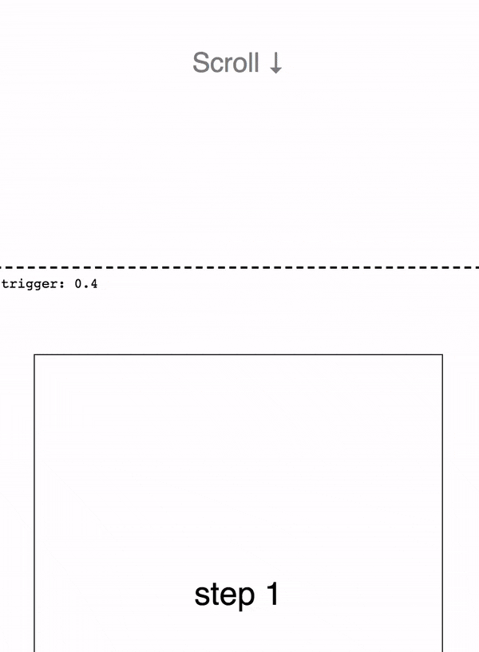

# React Scrollama

<p align="left">
  <a href="https://www.npmjs.com/package/react-scrollama">
    
  </a>
  <a href="https://david-dm.org/jsonkao/react-scrollama">
    
  </a>
</p>

React Scrollama is a lightweight interface for scrollytelling that uses [IntersectionObserver](https://developer.mozilla.org/docs/Web/API/Intersection_Observer_API) in favor of scroll events. It is adapted from Russel Goldenbeg's [Scrollama](https://github.com/russellgoldenberg/scrollama/).

As seen in:
<table>
<tbody>
<tr>
  <td>
     <br/> 
     <br/>
    17 interactive visualization <br/>
    stories using React Scrollama <br/>
    for scrollytelling
  </td>
  <td>
    <a href="https://datatopics.worldbank.org/sdgatlas/"></a>
  </td>
</tr>
<tr>
  <td>
     <br/> <a href="https://www.politico.com/interactives/2019/election-security-americas-voting-machines"><i>The scramble to secure <br/> America’s voting machines</i></a> <br/> by <a href="https://bzjin.github.io">Beatrice Jin</a>
  </td>
  <td>
    
  </td>
</tr>
<tr>
  <td>
    <br/> <a href="https://www.columbiaspectator.com/eye-lead/graduate-sex-diversity"><i>Sex Diversity Among Grad <br/> Students is Stagnating</i></a> <br/> by Jason Kao
  </td>
  <td>
    
  </td>
</tr>
</tbody>
</table>

## Demo

Take a look at [the live demo](https://jsonkao.github.io/react-scrollama), presented at [ReactNYC](https://www.youtube.com/watch?v=zR_LDPLMUvE).

<table>
  <tr>
    <th align="left">Basic step triggers</th>
    <th align="left">Sticky graphic on the side</th>
  </tr>
  <tr>
    <td></td>
    <td width="65%"></td>
  </tr>
</table>

## Install

React Scrollama can be installed as an [npm package](https://www.npmjs.com/package/react-scrollama):
```
$ npm install react-scrollama
```

**Note: As of version 2.2.0, the [IntersectionObserver polyfill](https://www.npmjs.com/package/intersection-observer) has been removed from the build. You must include it yourself for cross-browser support.** Check [here](https://caniuse.com/#feat=intersectionobserver) to see if you need to include the polyfill.

## Usage

A `Scrollama` component wraps a set of steps. Each `Step` component [must wrap a DOM element](https://github.com/jsonkao/react-scrollama/issues/19#issuecomment-624861326).

```jsx
<Scrollama onStepEnter={callback}>
  <Step data={1}>
    <div>...</div>
  </Step>
  <Step data={2}>
    <div>...</div>
  </Step>
</Scrollama>
```

`<Scrollama>` provides an interface for listening in on scroll triggers like entering or exiting a step. (Here's [a full list](#scrollama) of available props.)

A no-frills example:

```jsx
import React, { useState } from 'react';
import { Scrollama, Step } from 'react-scrollama';

const ScrollamaDemo = () => {
  const [currentStepIndex, setCurrentStepIndex] = useState(null);

  // This callback fires when a Step hits the offset threshold. It receives the
  // data prop of the step, which in this demo stores the index of the step.
  const onStepEnter = ({ data }) => {
    setCurrentStepIndex(data);
  };

  return (
    <div style={{ margin: '50vh 0', border: '2px dashed skyblue' }}>
      <div style={{ position: 'sticky', top: 0, border: '1px solid orchid' }}>
        I'm sticky. The current triggered step index is: {currentStepIndex}
      </div>
      <Scrollama onStepEnter={onStepEnter} debug>
        {[1, 2, 3, 4].map((_, stepIndex) => (
          <Step data={stepIndex} key={stepIndex}>
            <div
              style={{
                margin: '50vh 0',
                border: '1px solid gray',
                opacity: currentStepIndex === stepIndex ? 1 : 0.2,
              }}
            >
              I'm a Scrollama Step of index {stepIndex}
            </div>
          </Step>
        ))}
      </Scrollama>
    </div>
  );
};

export default ScrollamaDemo;
```

## API

React Scrollama components do not render into the DOM. They are meant to set up Intersection Observers on the elements inside the `<Step>` components. In the code above, only the `<div>` elements would show up in the DOM.

### `Scrollama`

These are the props you can set on the `Scrollama` component itself:

| Prop           | Type                      | Default | Description                                                                             |
|----------------|---------------------------|---------|-----------------------------------------------------------------------------------------|
| offset         | `number` (from 0 to 1)    | 0.3     | How far from the top of the viewport to trigger a step (as a proportion of view height) |
| progress       | `boolean`                 | false   | Whether to fire incremental step progress updates                                       |
| threshold      | `number` (greater than 1) | 4       | Granularity of the progress interval in pixels (smaller = more granular)                |
| onStepEnter    | `function`                |         | Callback that fires when the top or bottom edge of a step enters the offset threshold.  |
| onStepExit     | `function`                |         | Callback that fires when the top or bottom edge of a step exits the offset threshold.   |
| onStepProgress | `function`                |         | Callback that fires the progress a step has made through the threshold.                 |
| debug          | `boolean`                 | false   | Whether to show visual debugging tools.                                                 |

The `onStepEnter` and `onStepExit` callbacks receive one argument, an object, with the following properties:

```js
{
  element, // The DOM node of the step that was triggered
  data, // The data supplied to the step
  direction, // 'up' or 'down'
}
```

The `onStepProgress` callback receives one argument, an object, with the following properties:

```js
{
  element, // The DOM node of the step that was triggered
  data, // The data supplied to the step
  progress, // The percent of completion of the step (0 to 1)
}
```

To create a fixed graphic with text scrolling beside/over it, use `position: sticky;`. [How to use position sticky.](https://pudding.cool/process/scrollytelling-sticky/)

### `Step`

A `Step` element can contain one child, which must be a DOM element. To use a React component as the child node, it [must be wrapped with a DOM element](https://github.com/jsonkao/react-scrollama/issues/19#issuecomment-624861326) like `<div>`.

These are the props you can set on the `Step` component:

| Prop | Type | Default | Description                                                      |
|------|------|---------|------------------------------------------------------------------|
| data | any  |         | Data to be given to `<Scrollama>` callbacks when step triggered. |

You will also probably want to set a `key` prop on each `Step` if you're transforming an array of data into a list of `Step` elements (see [Lists and Keys](https://reactjs.org/docs/lists-and-keys.html)).

## Features roadmap

* Being able to use pixels instead of percent for offset value so stuff on mobile doesn't jump around on scroll direction change
* Currently, there is no way to throttle/customize React Scrollama's [resize listener](https://github.com/jsonkao/react-scrollama/blob/master/src/Scrollama.js#L104) 😢. We're working on this in [#44](https://github.com/jsonkao/react-scrollama/issues/44).
* Fire previous step triggers if they were jumped

## Contributors

* [jsonkao](https://github.com/jsonkao)
* [NicholasLYang](https://github.com/NicholasLYang)
* [jonesbp](https://github.com/jonesbp)
* [kennethormandy](https://github.com/kennethormandy)
* [cedricdelpoux](https://github.com/cedricdelpoux)
* [davidnmora](https://github.com/davidnmora)
* [jefffriesen](https://github.com/jefffriesen)
* [paolocorti](https://github.com/paolocorti)
* [elbertwang3](https://github.com/elbertwang3)
* [michaelgrotton](https://github.com/michaelgrotton)
* [jjrchrds](https://github.com/jjrchrds)
* [maerzhase](https://github.com/maerzhase)
* [goleary](https://github.com/goleary)
* [danieleguido](https://github.com/danieleguido)
* [Lane](https://github.com/Lane)

## License

MIT
